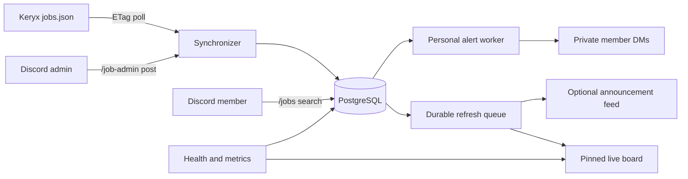

# Stentor

<p align="center">
  
</p>

Stentor is a Discord-native job board powered by [Keryx](https://github.com/GodlyDonuts/keryx). It maintains a live, interactive display of US internships and new-graduate roles, gives members a private search experience, and lets trusted server administrators publish and close community listings.

The name fits the job: Keryx is the herald that discovers opportunities; Stentor is the voice that carries them into a community.

## What it does

- Polls Keryx's canonical `data/jobs.json` with HTTP ETags every 15 minutes.
- Creates a safe baseline on first boot instead of dumping the entire historical catalog into Discord.
- Maintains one pinned live-board message that updates in place instead of flooding a channel.
- Uses Discord Components V2 for a native dashboard with a branded container, compact job sections, inline Apply buttons, and private explorer pages.
- Offers an optional classic announcement feed for servers that prefer one message per job.
- Opens stateless, private pagination when a member uses the board's program buttons; one member never changes the public display for everyone else.
- Applies per-server program, cycle, keyword, location, sponsorship, remote, and link-availability filters to the board and its browsing controls.
- Recreates a deleted board automatically on the next refresh or restart.
- Persists every delivery and retries transient Discord failures with bounded exponential backoff.
- Provides `/jobs search` and `/jobs latest` as private, paginated results.
- Lets each member keep up to five private alerts with program, cycle, keyword, location, remote, sponsorship, and link filters.
- Delivers member alerts immediately or as timezone-aware daily digests, with automatic DM-failure pausing.
- Lets members with **Manage Server** publish direct application links with `/job-admin post`, auto-expire listings, and visibly close them.
- Preserves Keryx's link-confidence status rather than implying every discovered link has the same trust level.
- Exposes liveness, readiness, and Prometheus metrics without requiring a public dashboard.

Stentor requests only the Discord `Guilds` gateway intent. It does not read messages, resumes, applications, direct messages, or member lists.

## Commands

| Command                     | Who can use it | Purpose                                                                     |
| --------------------------- | -------------- | --------------------------------------------------------------------------- |
| `/stentor configure`        | Manage Server  | Select live-board or announcement mode, its channel, and filters            |
| `/stentor board`            | Manage Server  | Create, repair, or immediately refresh the persistent board                 |
| `/stentor status`           | Manage Server  | Show configuration and Keryx freshness                                      |
| `/stentor pause` / `resume` | Manage Server  | Stop delivery without losing pending jobs                                   |
| `/stentor sync`             | Manage Server  | Request an immediate conditional refresh                                    |
| `/jobs latest`              | Everyone       | Browse the newest open roles                                                |
| `/jobs search`              | Everyone       | Search with program, cycle, location, remote, sponsorship, and link filters |
| `/alerts create`            | Everyone       | Create or replace a private immediate alert or daily digest                 |
| `/alerts manage`            | Everyone       | Inspect private alerts and delivery problems                                |
| `/alerts preview`           | Everyone       | Preview matches without backfilling the delivery queue                      |
| `/alerts pause` / `resume`  | Everyone       | Control a personal alert                                                    |
| `/alerts delete`            | Everyone       | Delete an alert and its delivery history                                    |
| `/alerts forget-me`         | Everyone       | Erase all personal alert data                                               |
| `/job-admin post`           | Manage Server  | Publish a server-scoped community listing                                   |
| `/job-admin close`          | Manage Server  | Close an admin-authored listing and update its message                      |

Search results from admin-authored listings remain scoped to the server that created them. Keryx listings are shared globally.

### Personal alert semantics

Filters are **OR within a category** and **AND across categories**. An alert with cycles `fall-2026, summer-2027`, program `internship`, and locations `remote, New York` means: an internship in either selected cycle, in either selected location. Create separate named alerts for alternatives such as “summer internships OR 2027 new-grad roles.”

New alerts start at creation time and never dump historical matches into DMs. `/alerts preview` searches the current catalog without changing that baseline. Daily digests contain at most eight jobs per message and continue in bounded batches when a day has an unusually large number of matches.

## Architecture



PostgreSQL is the source of truth for jobs, guild settings, sync state, and idempotent Discord deliveries. No Supabase, Firebase, Redis, or hosted control plane is required for a single VPS deployment.

## Create the Discord application

1. Create an application in the [Discord Developer Portal](https://discord.com/developers/applications).
2. On **Bot**, create a bot and reset/copy its token. Keep the token secret.
3. On **OAuth2 → URL Generator**, select the `bot` and `applications.commands` scopes.
4. Grant **View Channels**, **Send Messages**, **Embed Links**, and **Read Message History**. Grant **Manage Messages** if Stentor should pin its live board. Add **Mention Everyone** only for classic announcement feeds that ping non-mentionable roles.
5. Invite the bot, copy `.env.example` to `.env`, and set `DISCORD_TOKEN` and `DISCORD_APPLICATION_ID`.
6. For instant command registration while developing, also set `DISCORD_DEV_GUILD_ID`.

Set `POSTGRES_PASSWORD` to a long random value in production. Use URL-safe characters because Compose also places it in PostgreSQL's internal connection URL.

Register the slash commands once after adding or changing them:

```sh
npm run register
```

Guild commands appear immediately. Global commands can take Discord up to an hour to propagate.

## Local development

Requirements: Node.js 22 or newer, npm, and Docker.

```sh
cp .env.example .env
docker compose up -d postgres
npm install
npm run db:migrate
npm run register
npm run dev
```

Quality gates:

```sh
npm run format:check
npm run check
npm test
npm run build
```

## Deploy on a Vultr VPS

A small modern VPS is sufficient to begin; 1 shared vCPU and 1–2 GB RAM is comfortable for the bot and PostgreSQL. Use a current Ubuntu LTS or Debian release, install Docker Engine with the Compose plugin, and allow outbound HTTPS/WSS. Stentor does not need an inbound public port to talk to Discord.

On the server:

```sh
git clone https://github.com/GodlyDonuts/stentor.git
cd stentor
cp .env.example .env
# Edit .env and add the Discord credentials.
docker compose build
docker compose run --rm bot node dist/register-commands.js
docker compose up -d
docker compose ps
```

The compose file binds PostgreSQL and the health endpoint to loopback only. The bot container applies versioned SQL migrations under an advisory lock before it starts.

For updates:

```sh
sudo ./deploy/deploy.sh
```

The release script accepts only a clean production worktree, pulls `main` with
fast-forward semantics, validates Compose, builds the image, registers commands,
and requires readiness within 60 seconds. A failed rollout automatically restores
the previous image. The two newest rollback images are retained.

Back up the database regularly:

```sh
docker compose exec -T postgres pg_dump -U stentor -d stentor -Fc > stentor-$(date +%F).dump
```

Keep `.env` outside backups you share, enable Vultr's firewall, use SSH keys, disable password SSH login, and install unattended security updates. A managed PostgreSQL provider becomes useful only when you want independent database failover, multiple bot replicas, or operational separation.

## Operations

- `GET /health/live` reports process liveness.
- `GET /health/ready` verifies PostgreSQL and the Discord gateway.
- `GET /metrics` exports Prometheus metrics.
- JSON logs go to stdout and redact authorization/token fields.
- Keryx failures never erase previously indexed jobs. A failed fetch increments health state and is retried at the next interval.
- Board and announcement failures retry up to ten times. A `(guild, job)` primary key prevents duplicate delivery across restarts, while one stored board message ID prevents duplicate public displays.
- The optional files under `deploy/` provide a one-minute host watchdog and daily seven-day local database backups for VPS deployments.

## Security model

Keryx performs the upstream URL verification and normalization. Stentor displays its link-confidence classification exactly. Admin-submitted links are separately constrained to public HTTPS destinations: credentials, IP literals, local hosts, nonstandard ports, fragments, tracking parameters, and common shorteners are rejected. Community listings are labeled as admin-submitted, not Keryx-verified.

Discord authorization is enforced both in command metadata and at runtime. Mentions are restricted to the one configured role, and member-generated text is escaped before rendering in embeds.

## License

MIT
